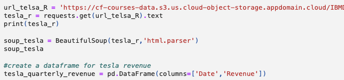

# Stock and Cryptocurrency Price Analysis through API Integration and Web Scraping

## Overview
This project demonstrates how I scraped, processed, and visualized Bitcoin price data using the CoinGecko API via the Python wrapper PyCoinGecko. It retrieves Bitcoin price data for the previous 30 days, processes it into a structured DataFrame, and visualizes the results with an interactive HTML-based candlestick chart generated using Plotly.

Additionally, web scraping was employed to extract revenue data for Tesla and GameStop from Macrotrends.com, and the Python library yfinance was utilized to retrieve their stock price data. The analysis compared price trends with revenue patterns to identify anomalies and profiled suspicious stock activities, such as short-selling patterns.

## Technical Skills Highlighted
- Worked with **RESTful APIs** for retrieving real-time and historical data.
- Used **Pandas** for data manipulation, such as aggregating daily price metrics, and converting time-series data.
- Created interactive candlestick charts using **Plotly**.
- Used web scrapping techniques with libraries such as **BeautifulSoup** for extracting financial data from the internet. Used **yfinance** to fetch stock price and conduct financial analysis.
  

## Using Pycoingecko (Coingecko API) to get realtime cryptocurrency price

**This is a screenshot of the interactive candlestick chart.**

## Tesla and GameStop Historical Stock & Revenue Data Scraping and Building a Dashboard

The screenshots below show the key code to fetch stock data and to scrape web information using BeautifulSoup.

